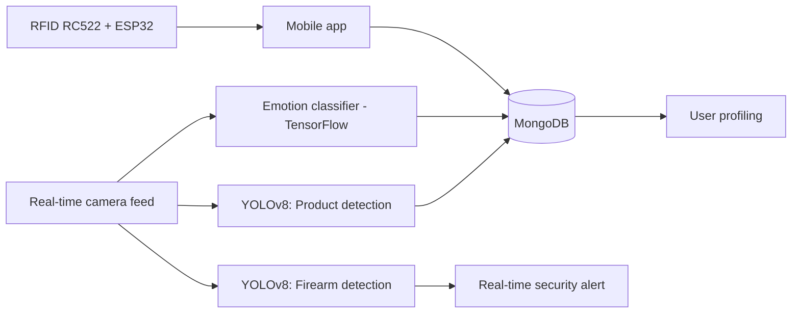

# Smart Store System with User Profiling and Threat Detection Using Computer Vision

<div align="center">

[](https://www.python.org/)
[](https://github.com/ultralytics/ultralytics)
[](https://www.tensorflow.org/)
[](https://pytorch.org/)
[](LICENSE)

**Universidad de Sucre · Sincelejo-Sucre, Colombia**

[Paper](#citation) · [Quick Start](#quick-start) · [Results](#results) · [Architecture](#architecture)

</div>

---

## Overview

Official documentation repository for the paper (originally published in Spanish):

> **Sistema de Tienda Inteligente con Perfilamiento de Usuarios y Detección de Amenazas mediante Visión Artificial**
>
> Lucas Mateo Rivadeneira Zarza, Jose Carlos Arroyo Cantero, Enoc David Samur Martínez, María Clareth Méndez Ramos, Melba Liliana Vertel Morinson
>
> 34° Simposio Internacional de Estadística (SIE 2025) — [View publication ↗](https://repositorio.unal.edu.co/handle/unal/89569)

*(English title: "Smart Store System with User Profiling and Threat Detection Using Computer Vision")*

Given the increasing insecurity in Latin America and the limited availability of technology in regions like Sucre, this project proposes a **smart store system based on computer vision** that combines real-time **user profiling** with **threat detection**. The system integrates three vision models — a **product detector**, a **firearm detector**, and an **emotion classifier** — with RFID-based identification hardware and a mobile application, to automate surveillance, streamline the checkout process, and characterize customer behavior. The research is applied, with a quantitative methodology, technological approach, explanatory scope, and non-experimental design, tested in a simulated store environment.

---

## Detected Classes

### Store products (YOLOv8)

| Class | Product |
|-------|---------|
| 0 | Apple |
| 1 | Pasta |
| 2 | Corn Flour (Harina Pan) |
| 3 | Paper |
| 4 | Coca-Cola |
| 5 | Pringles |
| 6 | Water |

### Threat detection (YOLOv8)

| Class | Description |
|-------|-------------|
| 0 | Weapons (handguns, revolvers) |
| 1 | Background |

### Emotion classification

| Class | Emotion |
|-------|---------|
| 0 | Angry |
| 1 | Disgust |
| 2 | Fear |
| 3 | Happy |
| 4 | Sad |
| 5 | Surprise |

---

## Architecture

The system is built around three independent computer-vision pipelines feeding a shared user-profiling backend:

- **Product detector:** YOLOv8, trained to identify packaged store items in real time to automate checkout and inventory tracking.
- **Threat detector:** YOLOv8, trained to identify firearms (handguns and revolvers) from live camera feeds, triggering real-time security alerts.
- **Emotion classifier:** neural network (TensorFlow) trained on the six universal emotions, used to enrich the customer profile during the shopping experience.
- **Identification & payment:** RFID RC522 sensor paired with an ESP32 microcontroller for user identification and payment processing.
- **Persistence layer:** MongoDB, storing purchase history and detected emotions per user.
- **Client (prototipe):** des application, the user-facing interface for the shopping flow.



---

## Results

### Product Detection (YOLOv8)

| Metric | Value |
|--------|-------|
| **mAP@50** | **0.975** |
| **mAP@50–95** | **0.910** |
| Precision | 0.958 |
| Recall | 0.959 |

| Class | Images | Instances | Precision | Recall | mAP@50 | mAP@50–95 |
|-------|--------|-----------|-----------|--------|--------|-----------|
| Apple | 400 | 1256 | 0.806 | 0.775 | 0.879 | 0.766 |
| Pasta | 400 | 400 | 0.994 | 0.994 | 0.994 | 0.955 |
| Corn Flour | 400 | 400 | 0.993 | 0.998 | 0.995 | 0.991 |
| Paper | 400 | 400 | 0.985 | 0.995 | 0.991 | 0.983 |
| Coca-Cola | 400 | 595 | 0.947 | 0.953 | 0.978 | 0.829 |
| Pringles | 400 | 1312 | 0.984 | 0.996 | 0.984 | 0.952 |
| Water | 400 | 509 | 0.998 | 1.000 | 0.995 | 0.897 |
| **Total** | **2800** | **4872** | **0.958** | **0.959** | **0.975** | **0.910** |

> The **Apple** class is the clear outlier (precision 0.806, recall 0.775), well below the rest of the classes (>0.94 across the board) — likely due to higher visual variability of unpackaged produce compared to packaged goods.

### Emotion Classification

| Metric | Value |
|--------|-------|
| **Accuracy** | **84.67%** |
| Weighted F1-Score | 0.8468 |

| Emotion | Precision | Recall | F1-Score | Support |
|---------|-----------|--------|----------|---------|
| Angry | 0.7660 | 0.9820 | 0.8606 | 500 |
| Disgust | 0.9123 | 0.8740 | 0.8927 | 500 |
| Fear | 0.7391 | 0.9120 | 0.8165 | 500 |
| Happy | 0.5932 | 0.7740 | 0.6543 | 500 |
| Sad | 0.8894 | 0.7560 | 0.8173 | 500 |
| Surprise | 0.9051 | 0.7820 | 0.8391 | 500 |

> **Happy** has the lowest precision (0.5932) of all six classes despite being reported as the model's strongest emotion in the original paper — this claim should be double-checked before being restated elsewhere.

### Threat Detection (YOLOv8)

Evaluated via confusion matrix on firearm vs. background classes, showing a high true-positive rate against a low number of false positives/negatives. *(Exact matrix values were not fully legible in the source PDF and are pending verification against training logs.)*

---

## Quick Start

### 1. Clone the repository

```bash
git clone https://github.com/<your-username>/smart-store-vision-system.git
cd smart-store-vision-system
```

### 2. Install dependencies

```bash
pip install -r requirements.txt
```

### 3. Run product / threat detection

```bash
python src/detect.py --model yolov8 --source path/to/video --task products
python src/detect.py --model yolov8 --source path/to/video --task weapons
```

### 4. Run emotion classification

```bash
python src/classify_emotion.py --weights path/to/checkpoint.h5
```

---

## Dataset

The system was trained on three independent datasets:

| Dataset | Purpose | Approx. size |
|---------|---------|--------------|
| Security (firearms) | Threat detection (YOLOv8) | ~25,000–25,515 images |
| Store (products) | Product recognition (YOLOv8) | ~28,000 images (2,800 used for validation, 7 classes) |
| Emotions | 6-class emotion classification | 36,000 images |

> **Note:** minor discrepancies exist between the totals reported in the paper's text and its figures for the security dataset (25,000 vs. 25,515) — see [`docs/dataset.md`](docs/dataset.md) for details before citing exact figures.

<p>
    
</p>

---


## Presentation History & Event Novelties
 
This project has been presented at three academic milestones, each showing a different stage of development. The table below summarizes what was new at each one, based directly on the three source documents.
 
| Event | Type | Reported Status | Key Novelties |
|-------|------|------------------|----------------|
| **RedCOLSI — Nodo Sucre** (Research-in-Progress Registration) | Registration form (Ingenierías area) | Early stage | First formal framing of the project: problem statement, general/specific objectives, and theoretical background defined. Core hardware selected (RFID RC522 for tag reading, ESP32 for processing/communication). Datasets for products, firearms, and facial expressions identified and under construction. No trained models or quantitative results yet. |
| **34° Simposio Internacional de Estadística (SIE 2025)** — Universidad Nacional de Colombia, 29/07–01/08/2025 | Conference paper | Advanced stage | First release of trained models and full quantitative results: YOLOv8 for product detection (mAP@50 = 0.975), YOLOv8 for firearm detection (confusion-matrix evaluation), and a TensorFlow emotion classifier (84.67% accuracy). MongoDB backend and prototipe of mobile app reported as functional, enabling purchase-history and emotion tracking per user. Dataset composition quantified (~25.5K security / ~28K store / 36K emotion images). |
| **STEM-IA Miami (GEMMA)** | Conference paper (event-adapted format) | Same results as SIE 2025 | Same technical content and results as the SIE 2025 paper, reformatted for the STEM-IA Miami template: adds a dedicated "Purpose" section and more detailed institutional affiliation (research group name spelled out per author) not present in the SIE 2025 version. |
 

---

## Authors

| Name | Institution | Email |
|------|-------------|-------|
| Lucas Mateo Rivadeneira Zarza | Universidad de Sucre | rivadeneirazarzalucas@gmail.com |
| Jose Carlos Arroyo Cantero | Universidad de Sucre | arroyocj.2o@gmail.com |
| Enoc David Samur Martínez | Universidad de Sucre | samurenoc@gmail.com |
| María Clareth Méndez Ramos | Universidad de Sucre | mariaclare29@gmail.com |
| Melba Liliana Vertel Morinson (Advisor) | Universidad de Sucre | melba.vertel@unisucre.edu.co |

---

## Citation

If you use this work in your research, please cite:

```bibtex
@inproceedings{rivadeneira2025smartstore,
  title     = {Sistema de Tienda Inteligente con Perfilamiento de Usuarios y Detección de Amenazas mediante Visión Artificial},
  author    = {Rivadeneira Zarza, Lucas Mateo and Arroyo Cantero, Jose Carlos and Samur Martinez, Enoc David and M{\'e}ndez Ramos, Mar{\'i}a Clareth and Vertel Morinson, Melba Liliana},
  booktitle = {34° Simposio Internacional de Estad{\'i}stica (SIE 2025)},
  year      = {2025},
  publisher = {Universidad Nacional de Colombia},
  url       = {}
}
```

---

## License

This project is licensed under the **MIT License** — see the [LICENSE](LICENSE) file for details.

---

## References

Key references from the paper:

- IBM (2021) — Automation
- Sanjurjo, D. (2020) — Armed violence and weapons proliferation in Latin America
- Fukushima, S. (2024) — AI and computer vision driving the future of retail
- Moya Cajas, M. & Bonilla, V. (2018) — Modeling and simulation of the Mitsubishi RV-2JA robot via EMG signals
- Abirami Vina (2024) — What is R-CNN? A quick overview (Ultralytics Blog)

---

<div align="center">
Made with ❤️ by <strong>GEMMA Research Group</strong> · Universidad de Sucre · Sincelejo, Colombia
</div>